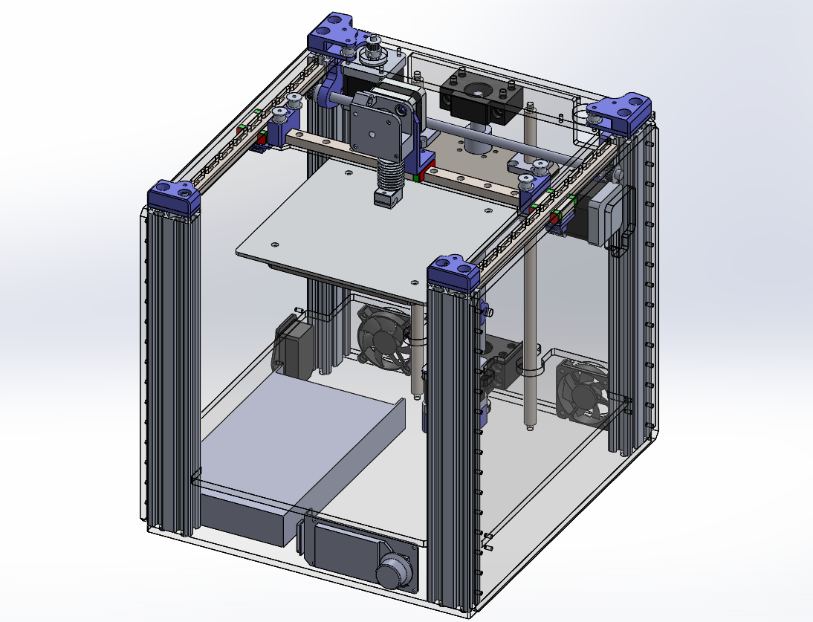

# GBot-Litchi

**⚠ Данный принтер находится в разработке. Детали могут изменится в любой момент. Скачивая и изготовливая их сейчас, вы делаете это на свой страх и риск. Промежуточный дизайн опубликован по многочисленным просьбам и для людей, которые не против принять участие в β-тесте.**

Это принтер с областью печати 180³мм³. Рама максимально универсальная и позволяет собирать принтер на нескольких кинематиках:
  * Hbot
  * CoreXY\*
  * GBot Sync\*\*
  * GBot Type A/C/D\*\*\*
  * IDEX\*\*\*\*

И сразу пару сносок:  
\* *под CoreXY детали в разработке, однако рама достаточно жесткая, **рекомендуемая кинематика — Hbot.***  
\*\* *GBot Sync — смесь HBot и Makerbot, где от Makerbot стоит пассивная ось Y, которая является синхронизатором и не допускает перекоса балки, присущего HBot'ам.*  
\*\*\* *автор собирает на GBot Type A, подробнее можно узнать тут [в этом видео про кинематики].*  
\*\*\*\* *IDEX гипотетически поддерживается, требуется растянуть раму по оси X.*

[в этом видео про кинематики]: https://youtu.be/pnqFbjBa5Ig
